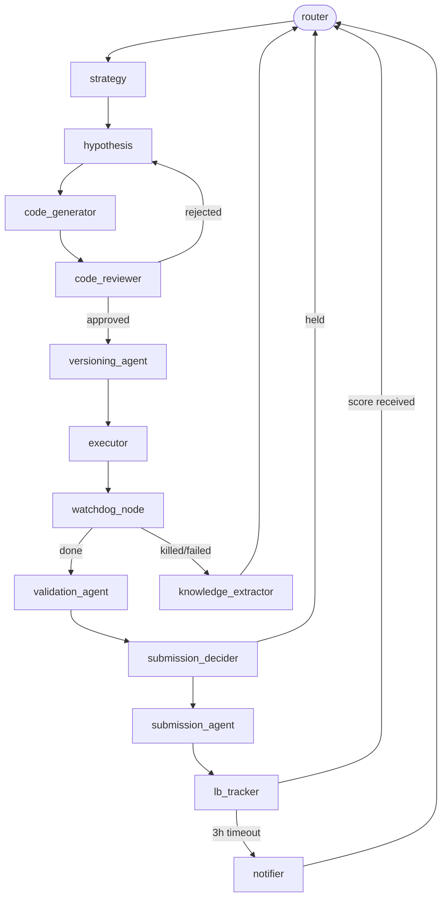
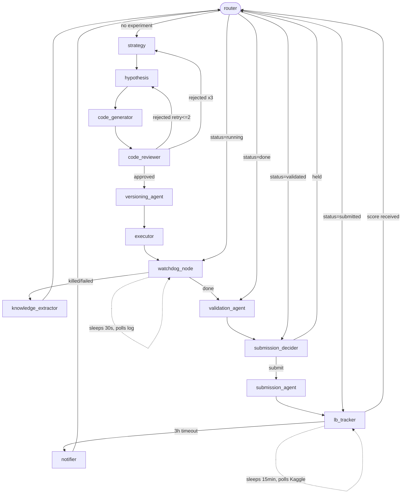
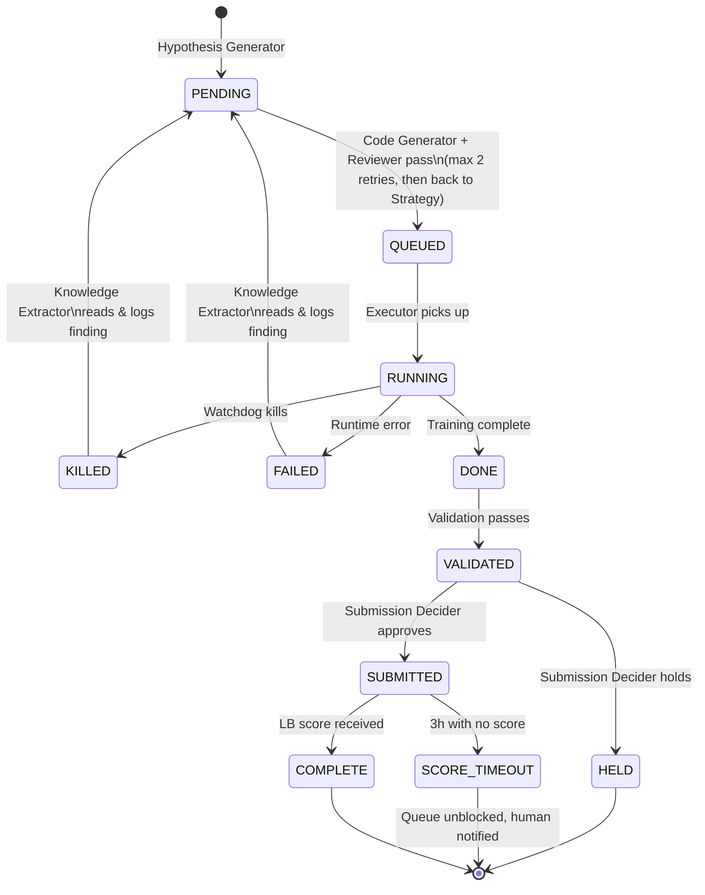

# Multi-Agent ML Competition System — Design (v2, honest)

---

## 1. Core Philosophy

The system treats a competition run as a **continuous improvement loop** with no human in the critical path. Every decision that a human currently makes manually — "should I try this feature?", "is this run worth submitting?", "what did I try last week?" — is delegated to a specific agent.

The human only sets initial config and reads Telegram messages.

**What this actually requires to work**: the LLM agents (Code Generator, Strategy Agent, Knowledge Extractor) must be given carefully constructed, specific context every single time they're called — not vague prompts. If that context assembly is sloppy, the whole loop degrades into noise. Every section below that touches an LLM agent describes *exactly* what context it receives and what structured output it must produce.

---

## 2. Architecture Overview

The system is built on **LangGraph**. The Conductor is a `StateGraph`. Each agent is a node. Routing between agents is done via conditional edges on the shared graph state — not a hand-rolled event bus.



**Why LangGraph specifically** (not CrewAI, not AutoGen, not A2A):

- **LangGraph**: stateful graph execution, built-in checkpointing, conditional edges, human interrupt/resume. The `StateGraph` is exactly the tick loop + event bus + state store in one. Best fit.
- **CrewAI**: high-level and opinionated. You lose precise control over submission gating, state transitions, and retry logic. Wrong fit when the logic *is* the value.
- **AutoGen**: conversational agent framework. This system isn't a conversation, it's a workflow.
- **A2A (Google)**: inter-agent HTTP protocol for distributed services. Overkill and adds network failure modes for a single-machine setup.
- **Prefect/Dagster**: workflow orchestration, not agent orchestration. No LLM routing, no conditional state transitions.

State persistence is handled by LangGraph's `SqliteSaver` checkpointer. If the process crashes, the graph resumes from the last checkpoint — no custom recovery code needed.

---

## 3. The State Store

The **LangGraph graph state** is the single source of truth for runtime state. It is a typed Python dict (`TypedDict`) that every node reads from and writes to. LangGraph handles thread safety and checkpointing — no hand-rolled locks.

```python
class GraphState(TypedDict):
    # Competition
    competition: CompetitionConfig        # metric, targets, deadline, days_remaining

    # Experiment lifecycle
    current_experiment: ExperimentSpec | None
    experiment_status: ExperimentStatus   # pending|queued|running|done|failed|killed|validated|submitted|held|score_timeout|complete
    running_pid: int | None
    run_id: str | None

    # Scores
    oof_score: float | None
    lb_score: float | None
    gap_history: list[float]              # OOF-LB gaps for last N scored submissions

    # Budget
    submissions_today: int
    last_submission_time: float | None

    # Strategy context
    directive: DirectiveJSON | None
    exploration_flag: bool
    consecutive_same_directive: int
    session_summary: str | None           # LLM-compressed strategy history, regenerated every 10 experiments

    # Code
    generated_script_path: str | None
    reviewer_feedback: str | None
    code_retry_count: int

    # Routing
    next_node: str                        # LangGraph uses this for conditional edges
    error_message: str | None
```

**Persistent files** (survive process restarts, live on disk alongside the SQLite checkpoint):

```
state/
  knowledge.json        # appended findings from Knowledge Extractor
  leaderboard.json      # LB score history (for gap trend analysis)
state/experiments/
  <run_id>.json         # archived per-experiment record after completion
```

Everything else — queue, locks, run status, budget — lives in the LangGraph state and its SQLite checkpoint. No `queue.json`, no lock files.

**`score_timeout` state**: if a submitted experiment has no LB score after 3 hours, the graph routes to the `score_timeout` node, unblocks the queue, and fires a Telegram notification. The Submission Decider treats the next candidate conservatively (don't submit again until OOF improvement is unambiguous).

---

## 4. Agent Catalog (18 agents)

18 agents across 5 layers. Each agent has exactly one responsibility and owns exactly one transition in the graph. The count is intentional: every agent that exists adds a failure mode. An agent is only justified if its logic cannot be absorbed as a sub-step of an adjacent node without making that node's responsibility ambiguous. Where the boundary is clear (format + validate before submitting, watch + parse logs during execution), they are merged into one node.

### ORCHESTRATION LAYER (3)

| # | Agent                   | Responsibility                                                                                                                                                                                                                      |
| - | ----------------------- | ----------------------------------------------------------------------------------------------------------------------------------------------------------------------------------------------------------------------------------- |
| 1 | **Conductor**     | Top-level tick loop (every 5 min). Checks agent health via Supervisor. Checks running jobs, LB polls, queue state, completed runs. Never codes, never trains.                                                                       |
| 2 | **State Manager** | All reads/writes go here. Manages lock acquisition with TTL. Detects and releases stale locks. Single write function — no agent writes directly.                                                                                   |
| 3 | **Supervisor**    | Separate from Conductor. Monitors all agent processes by PID. Restarts crashed agents. Reports to Conductor on each tick. If an agent crashes 3× in 10 min → marks it `degraded`, notifies human, Conductor reroutes around it. |

---

### STRATEGY LAYER (5)

| # | Agent                          | Responsibility                                                                                                                                                                                       |
| - | ------------------------------ | ---------------------------------------------------------------------------------------------------------------------------------------------------------------------------------------------------- |
| 4 | **Strategy Agent**       | Decides what kind of experiment to run next. See Section 8 for full implementation spec.                                                                                                             |
| 5 | **Hypothesis Generator** | Translates a directive into a concrete, schema-validated experiment spec. See Section 8.                                                                                                             |
| 6 | **Leaderboard Tracker**  | Polls Kaggle API for submission score. Handles the case where score never arrives (→`score_timeout`). Computes OOF→LB gap trend. Signals Strategy Agent if gap is widening.                      |
| 7 | **Ensemble Agent**       | Scans completed runs. Proposes blends using Nelder-Mead or optuna on OOF weights. Schedules blend experiments only when ≥3 uncorrelated base models exist (correlation threshold: r < 0.97 on OOF). |
| 8 | **Knowledge Extractor**  | Synthesizes experiment results into `knowledge.json`. See Section 9 for full implementation spec.                                                                                                  |

---

### CODE LAYER (3)

| #  | Agent                      | Responsibility                                                                                                                                                                                                                                                                             |
| -- | -------------------------- | ------------------------------------------------------------------------------------------------------------------------------------------------------------------------------------------------------------------------------------------------------------------------------------------ |
| 9  | **Code Generator**   | Takes a validated experiment spec + assembled context, produces a runnable script. See Section 7 for full implementation spec.                                                                                                                                                             |
| 10 | **Code Reviewer**    | Static analysis:`py_compile`, `pylint --errors-only`, import check against installed packages, shape consistency checks, no hardcoded paths. Also: sandbox run on 1% data with 60s timeout. Returns `pass/fail + issues`. Dependency check is a sub-step here, not a separate agent. |
| 11 | **Versioning Agent** | On Code Reviewer pass: assigns version tag (v42…),`git add + commit`, writes metadata JSON: `{parent_version, directive, what_changed, reviewer_output}`.                                                                                                                             |

---

### EXECUTION LAYER (3)

| #  | Agent                                 | Responsibility                                                                                                                                                                                                       |
| -- | ------------------------------------- | -------------------------------------------------------------------------------------------------------------------------------------------------------------------------------------------------------------------- |
| 12 | **Executor**                    | Launches approved scripts as subprocesses. Captures stdout/stderr to `logs/<run_id>.txt`. Returns PID to state store.                                                                                              |
| 13 | **Watchdog + Progress Monitor** | Single process. Tails the log file every 30s. Extracts fold/epoch/metric via regex on known log patterns. Writes live progress to state. Kills if: wall-clock > 2× estimate, RAM > 90%, no log output for 30 min.   |
| 14 | **Resource + Cache Manager**    | Single process. Monitors GPU mem, disk, all PIDs. Evicts old caches when disk > threshold, never evicts caches referenced by current best run or any RUNNING job. Signals Budget Manager on critical resource state. |

---

### VALIDATION & SUBMISSION LAYER (4)

| #  | Agent                        | Responsibility                                                                                                                                                                                                                                                                                       |
| -- | ---------------------------- | ---------------------------------------------------------------------------------------------------------------------------------------------------------------------------------------------------------------------------------------------------------------------------------------------------- |
| 15 | **Validation Agent**   | Checks OOF arrays: shape, no NaN, values in [0,1], metric matches logged score ±1e-4. Leakage check: OOF score on train folds must not significantly exceed holdout (threshold = 0.01 AUC). Returns `pass/fail`.                                                                                  |
| 16 | **Submission Decider** | See Section 10 for decision logic. Not just "OOF > best OOF."                                                                                                                                                                                                                                        |
| 17 | **Submission Agent**   | Format + validate + submit pipeline. Formats to match `SampleSubmission.csv` (column names, ID order, clip [0,1]). Validates row count, no nulls. Calls `kaggle competitions submit`. Retry with exponential backoff (max 3×). On success: writes submission ID to state, starts LB poll timer. |
| 18 | **Notifier**           | Subscribes to key events. Sends Telegram. The human's only touch point.                                                                                                                                                                                                                              |

---

## 5. Communication Protocol

There is no event bus. Agents don't publish to a queue. **LangGraph conditional edges are the routing layer.**

Each node returns an updated `GraphState`. The router node reads `state["next_node"]` (set by the previous node) and routes accordingly:

```python
def router(state: GraphState) -> str:
    """The only routing logic in the system. All transitions go through here."""
    status = state["experiment_status"]
    next_node = state.get("next_node")

    # Hard overrides based on status
    if status == "running":       return "watchdog"
    if status == "done":          return "validation"
    if status == "validated":     return "submission_decider"
    if status == "submitted":     return "lb_tracker"
    if status == "score_timeout": return "notifier"

    # Soft routing set by previous node
    return next_node or "strategy"
```

**What replaced each event type**:

| Old event               | Now                                                                                                                    |
| ----------------------- | ---------------------------------------------------------------------------------------------------------------------- |
| `run.queued`          | router sees `status=queued` → executor node                                                                         |
| `run.killed / failed` | watchdog node sets `status=killed`, `next_node=knowledge_extractor`                                                |
| `run.completed`       | executor node sets `status=done`, router → validation                                                               |
| `validation.passed`   | validation node sets `status=validated`, router → submission_decider                                                |
| `submission.sent`     | submission node sets `status=submitted`, router → lb_tracker                                                        |
| `lb.score.received`   | lb_tracker node sets `lb_score`, `status=complete`, `next_node=strategy`                                         |
| `lb.score.timeout`    | lb_tracker node sets `status=score_timeout`, `next_node=notifier`                                                  |
| `code.rejected`       | code_reviewer sets `next_node=hypothesis` + increments `code_retry_count`; if count ≥ 3 → `next_node=strategy` |
| `agent.degraded`      | node raises exception → LangGraph catches → supervisor node → notifier                                              |
| `budget.exhausted`    | router checks `submissions_today >= limit` before routing to submission_decider                                      |

**Crash recovery**: LangGraph `SqliteSaver` checkpoints state after every node. On restart, the graph resumes from the last completed node. No custom recovery code, no stale event cleanup.

---

## 6. The Main Loop

There is no tick loop. **The graph runs continuously** and sleeps only when it hits a waiting node (watchdog polling, LB polling). The entry point:

```python
from langgraph.graph import StateGraph
from langgraph.checkpoint.sqlite import SqliteSaver

checkpointer = SqliteSaver.from_conn_string("state/checkpoint.db")
graph = build_competition_graph()  # all nodes + conditional edges
app = graph.compile(checkpointer=checkpointer)

# Resume from last checkpoint or start fresh
config = {"configurable": {"thread_id": "digicow_run"}}
for event in app.stream(initial_state, config=config):
    pass  # events are logged; Notifier node fires Telegram as needed
```

**The graph flow** (replaces the tick loop):



**Parallel execution**: LangGraph supports parallel node branches natively via `Send` API. If `parallel_slots > 1`, the strategy node can dispatch multiple hypotheses simultaneously and the graph fans out.

---

## 7. State Machine Per Experiment



---

## 8. Strategy Agent & Hypothesis Generator — Full Spec

This is the most important section.

### Strategy Agent

The Strategy Agent is an LLM call with a structured prompt and a **required JSON output schema**. It is not a rule engine. It is not a hardcoded decision tree. It calls the LLM every tick when a new directive is needed.

**Context assembled before each call** (built by a `ContextBuilder` utility, not the agent itself):

```
- competition.json (metric, target, deadline, days_remaining)
- Top 10 experiments by OOF score: [version, model_type, key_params, OOF, LB, OOF-LB gap]
- Last 5 experiments in chronological order (to see recent trajectory)
- knowledge.json (what has been tried and failed)
- session_summary (compressed strategy history from GraphState — see Section 3)
- Current best submission score and gap to estimated LB top
- Experiment type distribution: how many CatBoost / LGB / XGB / NN / ensemble runs so far
- exploration_budget: what fraction of remaining time is left
```

**Output schema** (LLM must return valid JSON, otherwise retry):

```json
{
  "directive_type": "tune_existing | new_features | new_model_type | ensemble | seed_average",
  "target_model": "catboost | lgbm | xgboost | nn | blend",
  "rationale": "one sentence",
  "exploration_flag": true | false,
  "priority": 1-5
}
```

**Exploration vs. Exploitation rule** — built into the prompt, not left to the LLM to invent:

- If `exploration_flag=false` for the last 5 consecutive directives → force `exploration_flag=true` on next call.
- If `days_remaining < 2` → force `exploration_flag=false` (exploit mode only).
- If OOF→LB gap has widened for 3+ consecutive submissions → block all new submission directives until gap narrows or human overrides.

### Hypothesis Generator

Takes the Strategy Agent's JSON directive and produces a **concrete, schema-validated experiment spec**. Also an LLM call.

**Context assembled**:

```
- The directive JSON from Strategy Agent
- Parent script: full source code of the best current script of the target model type
- knowledge.json: param regions that failed for this model + target combo
- Current feature list (from competition.json or derived from parent script)
- Hardware budget: estimated GPU memory available, time budget for this run
```

**Output schema**:

```json
{
  "parent_version": "v41",
  "changes": [
    {"type": "param_change", "param": "depth", "old": 8, "new": 10},
    {"type": "feature_add", "feature_name": "rolling_7d_mean_milk", "code_snippet": "..."},
    {"type": "feature_remove", "feature_name": "svd_component_3"}
  ],
  "estimated_runtime_multiplier": 1.2,
  "rationale": "..."
}
```

The Code Generator receives this spec and modifies the parent script accordingly — it does **not** write from scratch. This is the key constraint. LLMs writing full ML training scripts from scratch fail constantly. LLMs making targeted, specified changes to existing working scripts fail much less often.

---

## 9. Code Generator — Full Spec

**The single highest-risk component in the system.** If this is wrong, everything downstream is wrong.

### What it does NOT do

- Does not write scripts from scratch.
- Does not decide what changes to make (that's Hypothesis Generator's job).
- Does not run the script (that's Executor).

### What it actually does

1. Loads the parent script as a string.
2. For each change in the `changes` array from the Hypothesis Generator spec:
   - `param_change`: find the param by name in the source (via regex or AST), replace value.
   - `feature_add`: insert the `code_snippet` at the feature engineering block (the parent script must have a clearly marked `# --- FEATURES START ---` / `# --- FEATURES END ---` comment block for this to work reliably).
   - `feature_remove`: remove referenced feature from the feature list and any dependent transforms.
3. Writes the modified script to a new versioned file.
4. Returns the new script path to Code Reviewer.

### Context given to the LLM (for non-trivial changes)

If the change is complex (e.g., adding a feature that requires a new join), the LLM receives:

```
- The exact lines around the insertion point (±20 lines)
- The change spec
- The data schema (column names, dtypes, available tables)
- The constraint: "Do not change anything outside the specified insertion point"
```

### What happens when Code Reviewer rejects

The rejection message (specific: "line 47: hardcoded path", "import X not installed") is fed back to the LLM as a correction prompt. Max 2 retries. If still failing after 2 retries, the `code.rejected` event fires with the full error, the Hypothesis Generator simplifies the change spec, and Code Generator tries again from a simpler base.

---

## 10. Knowledge Extractor — Full Spec

The original design said "after N experiments, synthesizes patterns." That's wrong on two counts: N is arbitrary, and synthesis needs to be metric-gated.

### When it runs

- After every `run.killed`, `run.failed`, `validation.failed` event.
- After every `lb.score.received` event.
- NOT on a fixed count.

### What it actually does

It reads the terminal-state experiment and extracts a **structured finding**:

```json
{
  "experiment_id": "run_042",
  "finding_type": "param_failure | feature_failure | model_failure | overfitting_signal",
  "scope": {
    "model_type": "catboost",
    "target": "07D",
    "param": "depth",
    "param_value": 12
  },
  "evidence": {
    "oof_score": 0.7821,
    "lb_score": null,
    "gap_vs_best": -0.004,
    "failure_reason": "KILLED: OOM at fold 3"
  },
  "conclusion": "depth=12 causes OOM on this hardware for catboost+07D. Max safe depth = 10."
}
```

This is written to `knowledge.json` as an append. The Hypothesis Generator reads `knowledge.json` before proposing any spec and filters out parameter regions that have a matching `finding_type=param_failure` entry.

### What it does NOT do

It does not do open-ended reasoning over all experiments at once. That's expensive, slow, and unreliable. It processes one terminal event and produces one structured finding. The cumulative `knowledge.json` is the synthesis — built incrementally.

---

## 11. Submission Decider — Full Spec

The original design said "only submit if OOF improves by > 0.0005." That's insufficient. The real logic:

```
SUBMIT only if ALL of the following:
  1. new_oof > best_oof + min_improvement (default: 0.0005)
  2. OOF→LB gap has NOT been widening for the last 3 consecutive scored submissions
     (gap_trend = linear regression slope on last 3 gaps; block if slope > 0.001/submission)
  3. submissions_today < daily_limit (default: 5, configurable)
  4. This is not a blend that was tuned on the same OOF folds used for scoring
     (blend weight search on OOF = guaranteed overfitting; flag this in experiment metadata)
  5. time_since_last_submission > 2h (Kaggle rate limit buffer)

HOLD if any check fails.
HOLD with escalation if check #2 fails (also notify human via Telegram).
```

---

## 12. Leaderboard Tracker — Full Spec

Kaggle submission processing takes 10–40 minutes and sometimes silently stalls. The polling logic must handle this.

```
ON submission.sent event:
  record submission_id, submitted_at timestamp

POLL every 15 minutes:
  call kaggle API: submissions list, check status of submission_id
  if status == "complete": extract score, fire lb.score.received
  if status == "error": fire lb.score.error, notify human, mark experiment failed
  if status == "pending" and elapsed > 3h: fire lb.score.timeout

ON lb.score.received:
  update leaderboard.json
  compute gap = lb_score vs oof_score for this experiment
  append gap to gap_history
  if len(gap_history) >= 3:
    compute slope of last 3 gaps
    if slope > 0.001: fire gap.widening event → Strategy Agent + Notifier
```

---

## 13. Concurrency & State Safety

File-based locks are gone. LangGraph handles state safety via its checkpointer.

**How it works**: every node receives an immutable snapshot of the current state, computes its output, and returns only the fields it modifies. LangGraph applies those updates atomically before checkpointing. Two nodes cannot run concurrently on the same thread unless you explicitly use the `Send` API for parallel branches.

**The one place file locking is still needed**: writing OOF arrays and trained model files to disk. These are large binary files outside the graph state. For these, use `fcntl.flock` (POSIX advisory lock) scoped tightly around the file write only — not around any LLM call.

```python
import fcntl

def write_oof_file(path, array):
    with open(path, 'wb') as f:
        fcntl.flock(f, fcntl.LOCK_EX)  # blocks until lock acquired
        np.save(f, array)
        fcntl.flock(f, fcntl.LOCK_UN)  # released immediately after write
```

No TTL management, no lock files in `state/locks/`, no deadlock detection code. The OS handles it.

---

## 14. Error Handling & Supervision

There is no separate Supervisor process. LangGraph handles node failures via its built-in exception model, augmented with a custom error node.

**Node-level errors** (LLM call fails, subprocess crashes, API down):

```python
def code_generator_node(state: GraphState) -> GraphState:
    try:
        result = call_llm(build_codegen_prompt(state))
        return {"generated_script_path": result, "next_node": "code_reviewer"}
    except Exception as e:
        return {
            "error_message": str(e),
            "code_retry_count": state["code_retry_count"] + 1,
            "next_node": "error_handler"
        }
```

**The error_handler node** (replaces the Supervisor's restart logic):

```python
def error_handler_node(state: GraphState) -> GraphState:
    node = state["next_node_before_error"]
    retries = state["node_retry_counts"].get(node, 0)
    if retries < 3:
        # retry the same node
        return {"node_retry_counts": {**state["node_retry_counts"], node: retries + 1},
                "next_node": node}
    else:
        # escalate: notify human, route to strategy to change direction
        notify_telegram(f"Node {node} failed 3 times: {state['error_message']}")
        return {"next_node": "strategy", "error_message": None}
```

**LangGraph checkpointing as crash recovery**: if the Python process itself crashes, on restart the graph reads the last SQLite checkpoint and resumes from the last successfully completed node. No heartbeat files, no PID monitoring, no re-launch logic needed.

---

## 15. Key Design Constraints

**Idempotency**: Every agent is re-runnable from any state. Conductor re-discovers state from the store on restart — no duplicated submissions, no corrupted caches.

**No shared mutable memory**: All communication goes through the LangGraph `GraphState`. No global variables, no direct calls between nodes.

**State safety**: LangGraph applies node outputs atomically before checkpointing. No hand-rolled locks for state transitions. See Section 13 for the one remaining file-level lock use case.

**LLM calls are outside file locks**: Never hold an `fcntl.flock` during an LLM call. See Section 13.

**No LLM writes code from scratch**: Code Generator only modifies parent scripts via specified changes. This is the most important implementation constraint. See Section 9.

**Graceful degradation**:

- Code Generator fails 3× → Strategy Agent changes direction.
- Submission Agent fails (API down) → retry with exponential backoff, then retry after 30 min cooldown.
- Any node fails → `error_handler` retries up to 3×, then escalates to Strategy Agent + Telegram notification.

**Auditability**: Every state transition logged with: agent name, timestamp, input hash, output hash. LLM prompts and responses stored to `logs/llm/<run_id>_<agent>_<timestamp>.json`.

**Human override**: `override.json` at workspace root. Picked up on Conductor's next tick. Supported directives: `pause`, `resume`, `force_submit <run_id>`, `kill <run_id>`, `set_directive <directive_json>`.

---

## 16. Failure Mode Catalog

These are the concrete ways this system will fail and what happens.

| Failure                                                        | Detection                                                                                                         | Recovery                                                                                |
| -------------------------------------------------------------- | ----------------------------------------------------------------------------------------------------------------- | --------------------------------------------------------------------------------------- |
| Code Generator produces bad code                               | Code Reviewer: sandbox on 1% data                                                                                 | Retry with reviewer error as feedback (max 2×), then simplify spec                     |
| Code Generator writes from scratch instead of modifying parent | Code Reviewer: check that >80% of parent script lines are present                                                 | Hard reject, re-send spec with explicit constraint                                      |
| LLM returns malformed JSON                                     | Schema validation on output                                                                                       | Retry with "your output was invalid JSON, here is the schema again" (max 2×)           |
| Watchdog node crashes mid-run                                  | LangGraph resumes from last checkpoint on restart; watchdog node re-reads log file by `run_id`                  | Re-attach to running process, continue monitoring                                       |
| Python process crashes entirely                                | LangGraph `SqliteSaver` checkpoint                                                                              | Graph resumes from last completed node on restart                                       |
| Kaggle LB score never arrives                                  | 3h poll timeout                                                                                                   | `score_timeout` state, queue unblocked, human notified                                |
| OOF→LB gap widening                                           | Leaderboard Tracker slope check                                                                                   | Block submissions, notify human, Strategy Agent forced into exploration mode            |
| Strategy Agent infinite loop (same directive repeatedly)       | Knowledge Extractor: track directive_type distribution; if same type 5× in a row with no OOF improvement → flag | Conductor forces `exploration_flag=true` override                                     |
| Disk full                                                      | Resource + Cache Manager                                                                                          | Evict old caches (never current best), notify human if still critical                   |
| GPU OOM in training                                            | KILLED state, log contains OOM traceback                                                                          | Knowledge Extractor records param config → OOM finding; Hypothesis Generator avoids it |
| Submission Decider submits a blend-searched-on-OOF result      | Experiment metadata flag `blend_weight_searched_on_oof=true`                                                    | Submission Decider checks this flag; hard block, notify human                           |

---

## 17. What's Still Hard (Honestly)

**Feature Ideation is still vague.** The original Feature Ideation Agent has been absorbed into Strategy Agent's "new_features" directive. But the actual feature ideation — what new features to try — still relies on LLM reasoning over the data description and past importances. That reasoning is only as good as the context it gets. Feature importances from CatBoost across 5 folds need to be aggregated and formatted clearly before the LLM sees them. If this context assembly is lazy, the features it proposes will be generic garbage.

**The Strategy Agent learns from its history through a three-layer memory stack.**

The LLM call is stateless. The system is not. There is a concrete difference:

1. **GraphState persistence** (`SqliteSaver`): `consecutive_same_directive`, `exploration_flag`, `gap_history`, and `session_summary` survive every process restart. The Strategy Agent reads these directly from state on every call — no re-inference needed.
2. **`knowledge.json` — long-term structured memory**: The Knowledge Extractor writes one structured finding per experiment event. Crucially, it must write at the *directive level*, not just the param level:

   ```json
   {"finding": "directive=new_features, target=catboost: 4 attempts, 0 OOF improvements > 0.001. Feature ideas from LLM are generic on this dataset. Avoid for next 3 runs.",
    "source_run_ids": ["v38", "v39", "v40", "v41"], "confidence": "high"}
   ```

   The Strategy Agent receives `knowledge.json` in full every call — directive-level failures are visible.
3. **`session_summary` — compressed session narrative**: Every 10 experiments, Knowledge Extractor runs a summarization pass: it reads `knowledge.json` + the last 10 experiment records, calls the LLM with the prompt *"Compress this into a 5-bullet strategy summary: what is working, what has failed pattern-wise, what should be tried next, what should never be tried again, what the OOF trend is"*, and writes the result into `GraphState.session_summary`. The Strategy Agent receives this summary in its context every call.

This is the same pattern used by proactive memory systems (e.g., `memU`): continuous extraction → compression → injection. The LLM never sees raw history; it sees structured, compressed, salient memory. Token cost stays flat regardless of how long the competition runs.

The only thing this requires: Knowledge Extractor must be disciplined — it must write directive-level findings, not just "depth=10 was slightly worse than depth=8". The prompt for Knowledge Extractor explicitly requires one directive-level finding and one param-level finding per event.

**Ensemble Agent blend search is also a form of overfitting.** Nelder-Mead on OOF weights will overfit the OOF if you run it long enough. Mitigations: hard cap on optimization iterations (50 max), minimum weight constraint (no weight < 0.05), validation that blend OOF improvement over best single model is > 0.001 before submitting.

**The whole system assumes your CV matches LB.** If your cross-validation is misconfigured (leaking time, wrong group split), the Strategy Agent will confidently optimize the wrong thing. No agent checks for this structurally. The Validation Agent checks for obvious leakage signals but can't check for subtle split misconfiguration. This has to be correct before you spin the system up.

---

## 18. Tech Stack (Committed, No Hedging)

| Component                      | Choice                                               | Why                                                                                                                                                |
| ------------------------------ | ---------------------------------------------------- | -------------------------------------------------------------------------------------------------------------------------------------------------- |
| Agent orchestration            | **LangGraph**                                  | StateGraph replaces the tick loop, event bus, and state manager. Built-in checkpointing, conditional edges, human interrupt, error handling.       |
| State persistence              | **LangGraph SqliteSaver**                      | Checkpoints graph state to SQLite after every node. Crash recovery is free.                                                                        |
| Persistent knowledge files     | Flat JSON (`knowledge.json`, `leaderboard.json`) | Survive process restarts independently of graph state. Appended to, never rewritten wholesale.                                                     |
| Agent runtime                  | Python functions (LangGraph nodes)                   | Each agent is a function `(GraphState) -> GraphState`. No threads, no PIDs to manage.                                                            |
| LLM for Code Gen / Strategy    | Gemini 1.5 Pro API                                   | Best instruction-following + long context for the price. Local Ollama is too slow for Code Generator on most hardware.                             |
| LLM client                     | `langchain-google-genai`                           | First-class LangGraph integration, structured output via `.with_structured_output()` — handles JSON schema enforcement and retry automatically. |
| Training subprocess            | Python `subprocess.Popen`                          | Training scripts run as child processes. Watchdog node monitors via `psutil`.                                                                    |
| Notifications                  | Telegram bot (`python-telegram-bot`)               | Simple API, free, mobile.                                                                                                                          |
| GPU monitoring                 | `pynvml`                                           | Per-process GPU stats.                                                                                                                             |
| File locks for OOF/model files | `fcntl.flock`                                      | OS-level, no infrastructure, scoped only to file writes (see Section 13).                                                                          |

---

## 19. What This Solves for This Project

Concretely, on the DigiCow competition, this system would:

- Auto-retrain with 5 seeds after tuning finishes (v41) — Hypothesis Generator + Executor handles this
- Submit if OOF improves, hold if not — Submission Decider handles this with the full logic from Section 11
- Would have blocked the v40 blend-searched submission — `blend_weight_searched_on_oof` flag in Submission Decider
- Wake up at night and run 3 more Optuna trials — no human needed in the loop
- Send Telegram when a new best is found, when gap widens, when an agent goes degraded

What this does NOT solve automatically:

- A fundamentally broken CV — the system will optimize the wrong thing confidently
- Bad feature engineering ideas — the LLM proposes, but if the data context given to it is thin, the proposals are thin
- Kaggle API being down — the system queues retries but can't bypass the API
