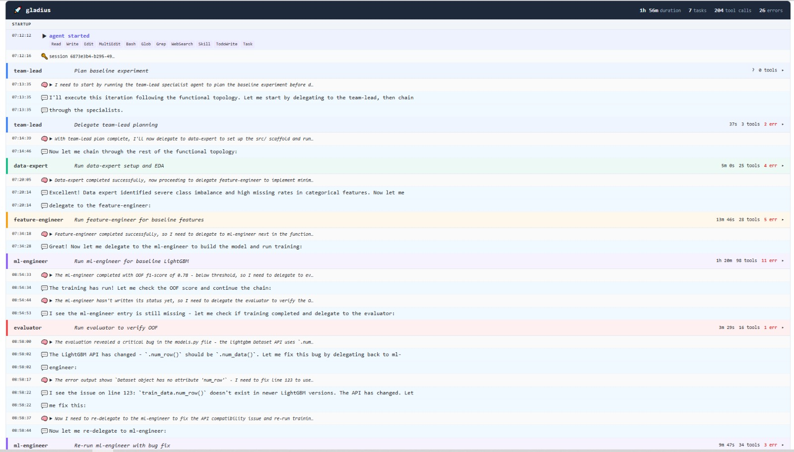

# gladius-agent

Fully autonomous multi-agent system for ML competitions. Given a competition directory it runs a continuous loop without human intervention: plans experiments, writes and executes code, evaluates OOF results, decides whether to submit, and synthesises learnings into persistent memory — all driven by [Claude Agent SDK](https://github.com/anthropics/claude-agent-sdk).



---

## Architecture

```
orchestrator.py
  │
  ├─ reads config from project.yaml (topology, model, platform, metric, …)
  ├─ bootstraps .claude/ project dir (idempotent)
  │
  └─ while iterations remain:
       write_claude_md()          ← fresh shared context every iteration
       topology.run_iteration()   ← all agent coordination is inside the topology
       act on IterationResult     ← update state, submit, check stop
       save to SQLite             ← crash-safe resume
```

The orchestrator is a thin loop. It never orchestrates individual agent phases directly — it delegates everything to the selected **topology**, which returns a structured `IterationResult`. No LangGraph, no graph edges, no `if/elif` phase routing.

### Topologies

Set `topology:` in `project.yaml`. Default is `functional`.

| Topology       | Style                                 | Agent flow                                                                                                                            |
| -------------- | ------------------------------------- | ------------------------------------------------------------------------------------------------------------------------------------- |
| `functional` | Apple — deep expertise pipeline      | team-lead → data-expert → feature-engineer → ml-engineer → evaluator → validator → memory-keeper                                |
| `two-pizza`  | Amazon — small cross-functional team | team-lead → full-stack coordinator (delegates to specialists) → validator → memory-keeper                                          |
| `platform`   | Google — shared infra layer          | team-lead → platform layer (data-expert + evaluator) → product layer (feature-engineer + ml-engineer) → validator → memory-keeper |
| `autonomous` | Meta — parallel independent teams    | team-lead (N plans) → N concurrent mini-teams → validator picks best → memory-keeper                                               |
| `matrix`     | Microsoft — dual authority           | team-lead (plan) → ml-engineer → both team-lead + domain-expert approve → evaluator → validator → memory-keeper                  |

The `autonomous` topology uses `--parallel N` to set N. Each branch is a full functional pipeline; the validator selects the best result.

### Roles

All roles are defined in `ROLE_CATALOG` (`gladius/agents/roles/catalog.py`). Each role is a `RoleDefinition` — name, description, system prompt, allowed tools, and skill-search hints.

| Role                 | Mode              | Session                             | Purpose                                                                                                                        |
| -------------------- | ----------------- | ----------------------------------- | ------------------------------------------------------------------------------------------------------------------------------ |
| `team-lead`        | read-only execute | **Resumed** across iterations | Reads MEMORY.md + experiment history; produces ordered experiment strategy as structured JSON `{"plan", "approach_summary"}` |
| `data-expert`      | execute           | Fresh per iteration                 | Bootstraps `src/` project scaffold; EDA — schema, distributions, missing values, class balance                              |
| `feature-engineer` | execute           | Fresh per iteration                 | Categorical encoding, numerical transforms, temporal features, interaction terms, SHAP pruning                                 |
| `ml-engineer`      | execute           | Fresh per iteration                 | Model training, CV, OOF evaluation; install deps; write-run-fix loop until script runs clean                                   |
| `domain-expert`    | execute           | Fresh per iteration                 | Diagnoses logical bugs (data leakage, CV contamination, wrong metric); dual approver in matrix topology                        |
| `evaluator`        | execute           | Fresh per iteration                 | Verifies `train.log`, extracts OOF score, re-runs if missing                                                                 |
| `validator`        | read-only         | Fresh per iteration                 | Compares OOF to best, checks submission format, recommends submit/hold, signals stop                                           |
| `memory-keeper`    | write             | Fresh per iteration                 | Rewrites `MEMORY.md` with what worked, what failed, patterns, and score history                                              |

`team-lead` is the only persistent role — its Claude SDK session is resumed every iteration so it accumulates deep competition context without paying context-window cost for full reinitialisation.

### Skill system

Active roles (`team-lead`, `data-expert`, `feature-engineer`, `ml-engineer`, `domain-expert`) carry pre-categorised skill hints in their `## Key skills` sections. At the start of each iteration they search the MCP `skills-on-demand` server and load a single relevant skill with `Skill({skill: "<name>"})`.

The skill server serves skills from two sources:

- **Bundled skills** in `gladius/utils/templates/skills/` — ML-specific (CV patterns, prediction blending, HPO, feature engineering, coding rules, submission format, …)
- **Scientific skills** from the `claude-scientific-skills/` submodule (170+ upstream skills: bioinformatics, cheminformatics, time-series, NLP, clinical, …)

Skills are loaded on-demand per iteration — no bulk injection, no per-turn latency cost once loaded.

### State

`CompetitionState` is a Python dataclass persisted to a normalised SQLite database (configured by `STATE_DB_RELATIVE_PATH` in `gladius/config.py`). The system resumes correctly after a crash; if `best_oof_score` was never flushed, it is recalibrated from experiment history on resume.

| Table             | Contents                                                                      |
| ----------------- | ----------------------------------------------------------------------------- |
| `competition`   | Static: competition_id, topology, metric, direction, data_dir — written once |
| `current_state` | Mutable: iteration, best scores, session IDs, submission count                |
| `experiments`   | One row per completed experiment with OOF score and solution files            |
| `failed_runs`   | One row per failed run                                                        |
| `plans`         | One row per team-lead plan (approach summary + full plan text)                |
| `event_log`     | Append-only event trace (iteration_complete, submission, error, …)           |
| `agent_runs`    | Per-agent timing and error records                                            |
| `error_log`     | Unhandled orchestrator errors                                                 |

### `.claude/` project layout

Bootstrapped on first run (idempotent — safe to re-run on resume). Templates live in `gladius/utils/templates/`.

```
.claude/
  agents/
    team-lead.md             — read-only execute: Read, Glob, Grep, WebSearch, Skill, mcp tools
    data-expert.md           — execute: Read, Write, Bash, Skill, mcp tools
    feature-engineer.md      — execute: Read, Write, Edit, Bash, Skill, mcp tools
    ml-engineer.md           — execute: Read, Write, Edit, Bash, Skill, mcp tools
    domain-expert.md         — execute/review: Read, Write, Edit, Bash, Skill, mcp tools
    evaluator.md             — execute: Read, Write, Bash (small model)
    validator.md             — read-only: Read, Glob, Grep, Bash (small model)
    memory-keeper.md         — write: Read, Write (small model)
  skills/
    ml-pipeline/             — CV patterns, baseline models, metric formulas
    feature-engineering/     — feature recipes, SHAP importance, pruning
    hpo/                     — Optuna Bayesian search
    prediction-blending/     — OOF blending, hill-climbing model selection
    coding-rules/            — no dead code, no unused vars/imports, clear contracts
    adversarial-validation/  — train/test distribution shift detection
    polars/                  — fast DataFrame ops
    submit-check/            — submission validation checklist
    uv-venv/                 — venv creation, package management
    git-workflow/            — commit format and branching
    + scientific skills (copied from claude-scientific-skills/ on first run)
  EXPERIMENT_STATE.json      — artifact handshake between roles (written per role, read by topology)
  agent-memory/
    team-lead/MEMORY.md      — persistent learnings rewritten by memory-keeper each iteration
  settings.json              — env vars, PostToolUse/PreToolUse hooks
scripts/
  after_edit.sh              — PostToolUse: py_compile on Edit/Write (catches syntax errors immediately)
  validate_bash.sh           — PreToolUse: blocks rm -rf / and rm -rf ~
CLAUDE.md                    — shared live context, rewritten by orchestrator each iteration
.mcp.json                    — MCP server registrations (platform + skills-on-demand)
```

**`CLAUDE.md`** is rewritten by the orchestrator at the start of every iteration. It carries competition settings, topology, current best scores, the last 5 experiments, failed approaches, a stagnation warning when OOF improvement has been < 0.001 for 3 iterations, and the skill search MCP endpoint. Every agent reads it automatically via Claude Code project-context loading.

**`MEMORY.md`** is rewritten by `memory-keeper` after every iteration. It records: key data insights, what works ✅, what fails ❌, recommended next approaches, and full score history. The `team-lead` reads it at the start of its resumed session. The path is injected as an absolute path into CLAUDE.md to prevent the model from reading the wrong global memory file.

### Platform support

| Platform       | Submit                                      | `platform:` value |
| -------------- | ------------------------------------------- | ------------------- |
| Kaggle         | `kaggle competitions submit` CLI          | `kaggle`          |
| Zindi          | `zindi` Python package                    | `zindi`           |
| Fake (offline) | Local scoring vs `.answers.csv` (AUC-ROC) | `fake`            |
| None           | Record artifact only, no upload             | `none`            |

Platform MCP servers run as subprocess stdio servers — not in-process Python objects — so they are reachable from the Claude Code CLI subprocess over IPC.

---

## Setup

### Requirements

- Python 3.12+
- `uv` — fast Python package manager (`pip install uv` or `brew install uv`)
- Platform credentials if not using `fake`: `~/.kaggle/kaggle.json` for Kaggle, `ZINDI_USERNAME` / `ZINDI_PASSWORD` for Zindi

### Install

```bash
git clone https://github.com/KameniAlexNea/gladius-agent
cd gladius-agent
uv sync
source .venv/bin/activate
```

### First-time CLI setup

The bundled `claude` binary shows an interactive theme picker on first run. Complete it once before running headlessly:

```bash
echo "1" | .venv/lib/python3.12/site-packages/claude_agent_sdk/_bundled/claude \
    --output-format stream-json --setting-sources "" 2>/dev/null || true
```

### Environment

Create a `.env` file in your competition directory (read automatically by `python-dotenv`):

```bash
# Required — set to your model:
GLADIUS_MODEL=claude-sonnet-4-5

# Optional — cheaper model for lightweight roles (evaluator, memory-keeper, validator):
# Defaults to same model as GLADIUS_MODEL when unset.
GLADIUS_SMALL_MODEL=claude-haiku-4-5

# Anthropic API key:
ANTHROPIC_API_KEY="sk-ant-..."

# Kaggle — or use ~/.kaggle/kaggle.json:
KAGGLE_USERNAME="..."
KAGGLE_KEY="..."

# Zindi:
ZINDI_USERNAME="..."
ZINDI_PASSWORD="..."

# Preferred — immutable challenge slug (from competition README config):
ZINDI_CHALLENGE_ID="financial-well-being-sme"

# Optional fallback — 0-based index of the Zindi challenge to select:
ZINDI_CHALLENGE_INDEX=0

# Optional — path to the claude-scientific-skills/scientific-skills/ directory:
# GLADIUS_SCIENTIFIC_SKILLS_PATH=/path/to/claude-scientific-skills/scientific-skills

# Optional — start loop at this iteration number (resume helper):
# Example: 6 means the next iteration executed will be iteration 6.
# GLADIUS_START_ITERATION=6

# Optional — LangSmith tracing (recommended when ANTHROPIC_BASE_URL is set
# and ANTHROPIC_API_KEY=OLLAMA):
# LANGSMITH_TRACING=true
# LANGSMITH_ENDPOINT=https://api.smith.langchain.com
# LANGSMITH_API_KEY=xxx
# LANGSMITH_PROJECT=gladius-agent
```

---

## Competition directory

Each competition lives in its own directory with a `project.yaml` config file and a `README.md` for context.

### `project.yaml` — primary config

```yaml
# Required
competition_id: my-competition
project_dir: /path/to/my-competition

# Competition type
platform: zindi          # kaggle | zindi | fake | none
metric: f1-score         # omit for open-ended tasks
direction: maximize      # maximize | minimize

# Data
data_dir: data           # relative to project_dir, or absolute
max_submissions_per_day: 5

# Agent topology
topology: functional     # functional | two-pizza | platform | autonomous | matrix

# Model
model: claude-opus-4-5
small_model: claude-haiku-4-5

# Iteration cap (optional — defaults to 20)
# max_iterations: 20
```

See [`examples/data_dog/project.yaml`](examples/data_dog/project.yaml) for a fully-annotated reference.

### `README.md` — task description (optional frontmatter)

The `README.md` is the human-readable task description that agents read for competition context. It may optionally carry a YAML frontmatter block with `submission_threshold` (the minimum OOF score required before a submission is made — this is the only field read from README.md at runtime):

```yaml
---
competition_id: my-competition
submission_threshold: 0.85
---

# My Competition Title

...competition description and data documentation here...
```

For open-ended (non-metric) tasks the README is the primary source of truth — agents derive goal, deliverables, and self-assessment criteria from it.

`data_dir` must contain at minimum:

- `train.csv`
- `test.csv`
- `sample_submission.csv`

### Example: offline testing with fake competition

```bash
cd examples/fake_competition
gladius project.yaml
```

`examples/fake_competition` is a 1000-row binary classification dataset. `platform: fake` — submissions scored locally against `data/.answers.csv` using AUC-ROC. No API key needed.

---

## CLI

```bash
gladius CONFIG [--max-turns N]
```

| Argument          | Description                                                |
| ----------------- | ---------------------------------------------------------- |
| `CONFIG`        | Path to `project.yaml`                                   |
| `--max-turns N` | Hard cap on agent turns per iteration (default: unlimited) |

```bash
# Run a competition
gladius examples/data_dog/project.yaml

# Run with a turn cap
gladius examples/data_dog/project.yaml --max-turns 100
```

`max_iterations` is set in `project.yaml`. The run stops when that count is reached, a plateau stop-signal is written, or 3 consecutive errors occur.

---

## Project structure

```
gladius/
  orchestrator.py          — Main loop: topology selection, crash-safe state, submission logic
  state.py                 — CompetitionState dataclass + StateStore (SQLite)
  cli.py                   — Argument parsing + gladius status command
  preflight.py             — Pre-run environment and config validation
  submission.py            — Platform-agnostic submission + score helpers
  agents/
    _agent_defs.py         — SUBAGENT_DEFINITIONS bridge (thin wrapper over ROLE_CATALOG)
    roles/
      catalog.py           — ROLE_CATALOG: 14 RoleDefinition frozen dataclasses (8 workers + 6 coordinators)
      specs.py             — Shared prompt builders + output JSON schemas
    topologies/
      functional.py        — Apple-style sequential pipeline
      two_pizza.py         — Amazon-style small cross-functional team
      platform.py          — Google-style platform + product layers
      autonomous.py        — Meta-style parallel mini-teams
      matrix.py            — Microsoft-style dual-authority approval
    runtime/
      agent_runner.py      — run_agent(): streaming, retry, DB timing (all roles)
      helpers.py           — build_runtime_agents(), small-model routing
  tools/
    fake_platform_tools.py — Offline scoring MCP server (AUC-ROC vs answer key)
    kaggle_tools.py        — Kaggle API MCP server (subprocess stdio)
    zindi_tools.py         — Zindi submission MCP server (subprocess stdio)
  db/
    schema.py              — CREATE TABLE statements
    queries.py             — Typed query helpers
    store.py               — StateStore: load/save/record_event/record_code_snapshots
  utils/
    competition_config.py  — Reads YAML frontmatter from competition README.md
    project_setup.py       — Bootstraps .claude/ layout, copies skills + agent files, writes CLAUDE.md
    templates/
      agents/              — one .md per role (14 total: 8 workers + 6 coordinators)
      skills/              — one .md per bundled skill
      hooks/               — after_edit.sh, validate_bash.sh
      memory/              — MEMORY.md starter template
examples/
  fake_competition/        — Customer Churn Prediction (offline, AUC-ROC)
  data_dog/                — Zindi financial well-being competition (F1-score, multiclass)
```

---

## Development

```bash
# Install dev dependencies
uv sync

# Run tests
python -m pytest

# Format
tox -e format

# Run example competition (1 iteration, fresh start)
gladius --competition-dir examples/fake_competition --iterations 1 --no-resume
```

### Visualising a run

Use the [gladius-log-viewer](https://github.com/KameniAlexNea/gladius-log-viewer) to inspect agent traces interactively:

```bash
git clone git@github.com:KameniAlexNea/gladius-log-viewer.git
cd gladius-log-viewer
uv run python app.py --log /path/to/gladius.log
```

---

## Design principles

1. **Topology-driven — not hard-coded phases.** The orchestrator selects a management topology (functional, two-pizza, platform, autonomous, matrix) from the competition config and calls `topology.run_iteration()`. All agent coordination lives inside the topology class; the orchestrator loop is a thin wrapper that acts on the returned `IterationResult`.
2. **ROLE_CATALOG is the single source of truth.** All 14 agent roles (8 workers + 6 coordinators) are declared as frozen `RoleDefinition` dataclasses loaded from `templates/agents/*.md`. Topologies wire them together differently; the roles themselves never change.
3. **One persistent role, rest are fresh.** `team-lead` resumes its Claude SDK session across iterations — it accumulates deep competition context in memory. Every other role starts fresh, ensuring clean context for each phase.
4. **Read-only planning for the team-lead.** `team-lead` runs via `run_agent()` with a tool allowlist that restricts it to `Read`, `Glob`, `Grep`, `WebSearch`, and `Skill`. It produces its plan as structured JSON `{"plan", "approach_summary"}` via a JSON schema output constraint — no `Bash`, `Write`, or `Task` calls possible.
5. **Artifact handshake, not free-text routing.** After each role completes it writes the runtime state file configured by `RUNTIME_EXPERIMENT_STATE_RELATIVE_PATH` in `gladius/config.py`. The topology reads this structured JSON to determine what to do next — no parsing of conversation text.
6. **Orchestrator owns all state mutation.** Roles output structured JSON; the orchestrator acts on it. No role mutates `best_oof_score` directly. Improvement is always re-verified deterministically in Python, regardless of what the validator says.
7. **On-demand skill loading.** Each active role carries pre-categorised skill hints. At startup it calls `mcp__skills-on-demand__search_skills` and loads a single best-match skill with `Skill({skill: "<name>"})`. No bulk injection; no per-turn latency once loaded.
8. **CLAUDE.md as shared live context.** The orchestrator rewrites `CLAUDE.md` once per iteration. Every role reads it at session start via Claude Code project-context loading — no need to inject full state into every prompt.
9. **Resilient resume.** State is saved to SQLite after every iteration. On resume, if `best_oof_score` was never flushed (e.g. validation crashed), it is recalibrated from experiment history. Three consecutive errors halt the run cleanly.
10. **Structured output via `json_schema`.** Every role specifies a JSON schema in its task prompt. The topology verifies the output before acting on it — no bare `json.loads()` + exception handling.
