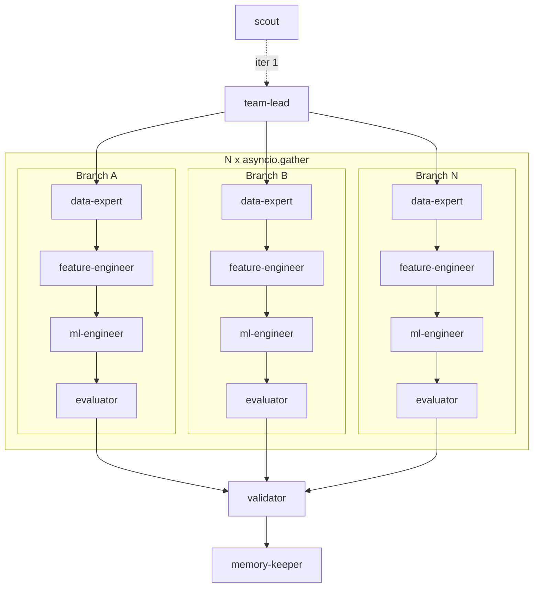

**Autonomous topology** — N mini-teams run the full pipeline concurrently; the validator picks the best result.



### How this iteration works

0. **scout** _(iteration 1 only)_ scans the data directory, profiles shapes/distributions/risks, and writes `.claude/DATA_BRIEFING.md`. Skip if the briefing already exists.
1. **team-lead** reads `DATA_BRIEFING.md` + produces exactly N plans — each plan MUST use a genuinely different approach (different model family, different feature strategy, different CV). Outputs `{"plans": [{"plan": "...", "approach_summary": "..."}, ...]}`. 
2. N **mini-teams** run concurrently via `asyncio.gather`. Each team is a full functional pipeline: **data-expert → feature-engineer → ml-engineer → evaluator**. Each team works in its own isolated working directory.
3. **validator** receives all N results, compares OOF scores, selects the winner. All results are recorded regardless of outcome.
4. **memory-keeper** records all N results, noting which strategy won and which failed.

### Handoff contract — EXPERIMENT_STATE.json (per mini-team)

Each team writes to its own scoped state file `EXPERIMENT_STATE_<branch>.json`:

```json
{
  "branch": "A",
  "data_expert":      {"status": "success", "files": [...], "eda_summary": "..."},
  "feature_engineer": {"status": "success", "features_added": [...]},
  "ml_engineer":      {"status": "success", "oof_score": 0.0, "metric": "f1-score"},
  "evaluator":        {"status": "success", "oof_score": 0.0, "metric": "f1-score"}
}
```

**N is controlled by `--parallel N` CLI flag (default: 1).**

**Rule:** Teams cannot read each other's intermediate files. Each team writes its final `artifacts/oof_<branch>.npy`. The validator reads all of them to pick the winner.
