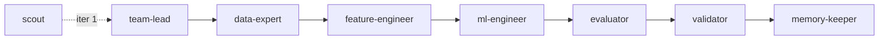

**Functional topology** — sequential pipeline, each role hands off to the next via `EXPERIMENT_STATE.json`.



### How this iteration works

0. **scout** _(iteration 1 only)_ scans the data directory, profiles shapes/distributions/risks, and writes `.claude/DATA_BRIEFING.md`. Skip if the briefing already exists.
1. **team-lead** reads `DATA_BRIEFING.md` + `MEMORY.md` + experiment history, outputs `{"plan": "...", "approach_summary": "..."}`.
2. **data-expert** reads the plan, sets up `src/` scaffold, runs EDA. Writes `EXPERIMENT_STATE.json["data_expert"]`.
3. **feature-engineer** reads the plan + `src/data.py`, implements features in `src/features.py`. Writes `EXPERIMENT_STATE.json["feature_engineer"]`.
4. **ml-engineer** reads the plan + `src/`, writes `src/models.py` + `scripts/train.py`, runs training, saves `artifacts/oof.npy`. Writes `EXPERIMENT_STATE.json["ml_engineer"]`.
5. **evaluator** confirms `OOF <metric>: <value>` appears in `train.log`, verifies `artifacts/oof.npy`. Writes `EXPERIMENT_STATE.json["evaluator"]`.
6. **validator** compares OOF to best score, checks submission format. Emits structured JSON — does NOT write files.
7. **memory-keeper** rewrites `.claude/agent-memory/team-lead/MEMORY.md`.

### Handoff contract — EXPERIMENT_STATE.json

Every executing role MUST write its entry as its **final action**. The topology stops if an entry is missing or `status != "success"`.

```json
{
  "data_expert":      {"status": "success", "files": [...], "eda_summary": "..."},
  "feature_engineer": {"status": "success", "features_added": [...]},
  "ml_engineer":      {"status": "success", "oof_score": 0.0, "metric": "f1-score", "files_modified": [...]},
  "evaluator":        {"status": "success", "oof_score": 0.0, "metric": "f1-score"}
}
```

**Rule:** Read `EXPERIMENT_STATE.json` at startup to see what previous roles already completed. Do not redo work that is already marked `"success"`.
