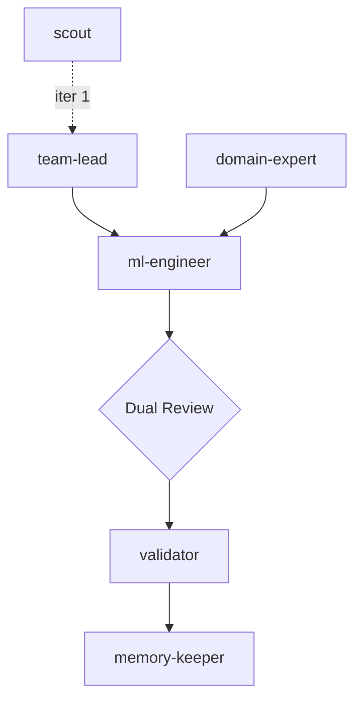

**Matrix topology** — the ml-engineer's work requires independent approval from both a technical reviewer and a domain reviewer before advancing.



### How this iteration works

0. **scout** _(iteration 1 only)_ scans the data directory, profiles shapes/distributions/risks, and writes `.claude/DATA_BRIEFING.md`. Skip if the briefing already exists.
1. **team-lead** reads `DATA_BRIEFING.md` + `MEMORY.md` + experiment history, outputs `{"plan": "...", "approach_summary": "..."}`. 
2. **ml-engineer** implements the full pipeline (`src/features.py`, `src/models.py`, `scripts/train.py`), runs training, saves `artifacts/oof.npy`. Writes `EXPERIMENT_STATE.json["ml_engineer"]`.
3. **team-lead** (review mode) reads all deliverables, checks technical correctness. Writes `EXPERIMENT_STATE.json["technical_review"]`.
4. **domain-expert** (review mode) checks for data leakage, CV contamination, wrong metric, distribution issues. Rates each finding `CRITICAL` or `WARNING`. Writes `EXPERIMENT_STATE.json["domain_review"]`.
5. **If both approve:** **evaluator** extracts OOF score → **validator** judges result → **memory-keeper** updates `MEMORY.md`.
6. **If either rejects (CRITICAL issues):** **domain-expert** applies minimal targeted fixes, **ml-engineer** re-runs. Maximum 2 rejection cycles.

### Handoff contract — EXPERIMENT_STATE.json

```json
{
  "ml_engineer":     {"status": "success", "oof_score": 0.0, "metric": "f1-score", "files_modified": [...]},
  "technical_review":{"status": "approved"|"rejected", "critical_issues": [...], "warnings": [...], "reasoning": "..."},
  "domain_review":   {"status": "approved"|"rejected", "critical_issues": [...], "warnings": [...], "reasoning": "..."},
  "evaluator":       {"status": "success", "oof_score": 0.0, "metric": "f1-score"}
}
```

**Rule:** The evaluator only runs after BOTH `technical_review.status == "approved"` AND `domain_review.status == "approved"`.
