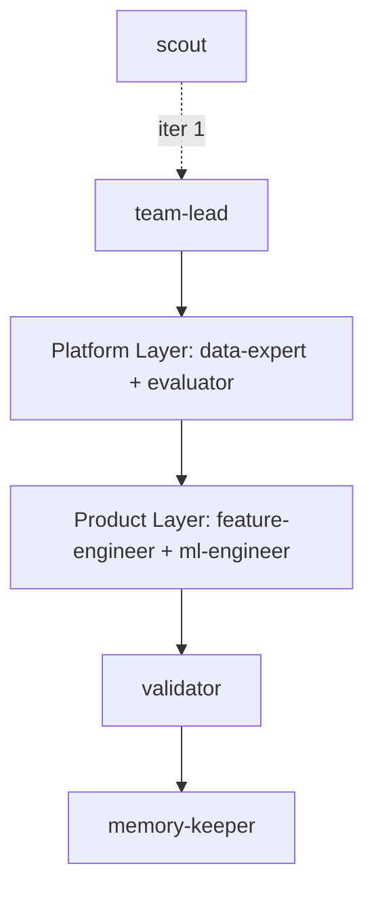

**Platform topology** — infrastructure is provisioned once; product agents consume it without duplicating setup.



### How this iteration works

0. **scout** _(iteration 1 only)_ scans the data directory, profiles shapes/distributions/risks, and writes `.claude/DATA_BRIEFING.md`. Skip if the briefing already exists.
1. **team-lead** reads `DATA_BRIEFING.md` + `MEMORY.md` + experiment history, outputs `{"plan": "...", "approach_summary": "..."}`. 
2. **platform-layer** (coordinator) runs **data-expert** to build `src/` scaffold and `src/data.py`. Confirms `scripts/train.py` exposes the `OOF <metric>: <value>` print contract. Writes `EXPERIMENT_STATE.json["platform"]`.
3. **product-layer** (coordinator) reads the plan + platform outputs, runs **feature-engineer** then **ml-engineer**. Writes `EXPERIMENT_STATE.json["product"]`.
4. **validator** compares OOF to best score, checks submission format. Emits structured JSON — does NOT write files.
5. **memory-keeper** rewrites `.claude/agent-memory/team-lead/MEMORY.md`.

### Handoff contract — EXPERIMENT_STATE.json

```json
{
  "platform": {"status": "success", "scaffold_files": [...], "train_contract_verified": true},
  "data_expert":      {"status": "success", "files": [...], "eda_summary": "..."},
  "product":          {"status": "success", "oof_score": 0.0},
  "feature_engineer": {"status": "success", "features_added": [...]},
  "ml_engineer":      {"status": "success", "oof_score": 0.0, "metric": "f1-score", "files_modified": [...]},
  "evaluator":        {"status": "success", "oof_score": 0.0, "metric": "f1-score"}
}
```

**Rule:** Product agents treat `src/data.py` and the train print contract as stable APIs — they must not modify them.
