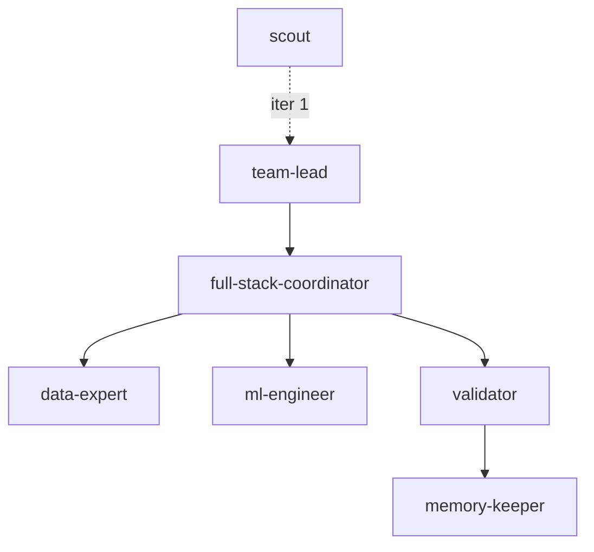

**Two-Pizza topology** — one coordinator owns the full experiment, delegates to specialists only when needed.



### How this iteration works

0. **scout** _(iteration 1 only)_ scans the data directory, profiles shapes/distributions/risks, and writes `{{RUNTIME_DATA_BRIEFING_RELATIVE_PATH}}`. Skip if the briefing already exists.
1. **team-lead** reads `DATA_BRIEFING.md` + `MEMORY.md` + experiment history, outputs `{"plan": "...", "approach_summary": "..."}`. 
2. **full-stack-coordinator** receives the plan, reads `EXPERIMENT_STATE.json` to assess what already exists, then decides which specialists to spawn and in what order:
   - spawn **data-expert** if `src/` scaffold is missing or `data_expert.status` is not `"success"`
   - spawn **feature-engineer** if the plan requires new feature work
   - spawn **ml-engineer** to run training (always)
   - spawn **evaluator** to verify the OOF score
3. **validator** compares OOF to best score, checks submission format. Emits structured JSON — does NOT write files.
4. **memory-keeper** rewrites `{{TEAM_LEAD_MEMORY_RELATIVE_PATH}}`.

### Handoff contract — EXPERIMENT_STATE.json

Every executing role MUST write its entry as its **final action**. The coordinator reads this after each spawn to decide the next step.

```json
{
  "data_expert":      {"status": "success", "files": [...], "eda_summary": "..."},
  "feature_engineer": {"status": "success", "features_added": [...]},
  "ml_engineer":      {"status": "success", "oof_score": 0.0, "metric": "f1-score", "files_modified": [...]},
  "evaluator":        {"status": "success", "oof_score": 0.0, "metric": "f1-score"}
}
```

**Rule:** The coordinator skips spawning a specialist if their entry already shows `"success"`. Never redo work already done.
