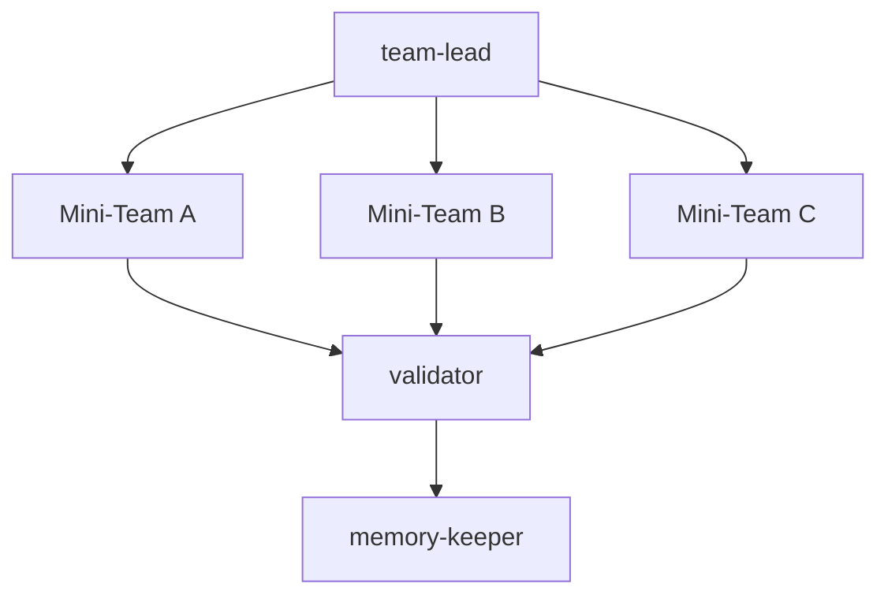

**Autonomous topology** — Meta-style parallel independent teams.
The `team-lead` generates N distinct experiment plans. N mini-teams run concurrently in their own isolated environments. The `validator` selects the "Evolutionary Winner."

| Role | Responsibility |
| --- | --- |
| **team-lead** | Portfolio Manager. Diversifies the approach by generating multiple plans. |
| **mini-teams** | Rapid Prototyping. Each team (data-expert + feature-engineer + ml-engineer) builds a full pipeline for their specific plan. |
| **validator** | Selection Pressure. Picks the best OOF to promote to the leaderboard. |
| **memory-keeper** | Synthesis. Aggregates findings from all parallel branches into one cohesive history. |

**N is controlled by `--parallel N` CLI flag (default: 1).**

**Handoff contract:** Every executing role MUST write its result to `.claude/EXPERIMENT_STATE.json` as its final action. The topology reads this file to gate progression — a missing or malformed entry halts the pipeline.
