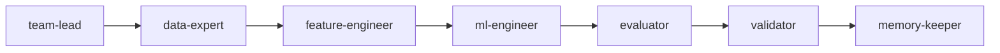

**Functional topology** — Apple-style deep-expertise pipeline.
Control flow is a linear sequence where each agent is a "Directly Responsible Individual" (DRI) for their phase. Quality at the source is the priority; the `ml-engineer` expects perfect data from the `data-expert`.

| Role | Responsibility |
| --- | --- |
| **team-lead** | Visionary alignment. Sets the "Product" (Experiment) roadmap. |
| **data-expert** | Data Integrity. Ensures the foundation is bulletproof. |
| **feature-engineer** | Technical Craft. Designs the most representative signals. |
| **ml-engineer** | Performance Engineering. Optimizes model architecture and CV. |
| **evaluator** | QA Testing. Validates the logs and artifact existence. |
| **validator** | Final Sign-off. Acts as the impartial judge for submission quality. |
| **memory-keeper** | Institutional Knowledge. Documents the "why" behind every success/failure. |

**Handoff contract:** Every executing role MUST write its result to `.claude/EXPERIMENT_STATE.json` as its final action. The topology reads this file to gate progression — a missing or malformed entry halts the pipeline.
