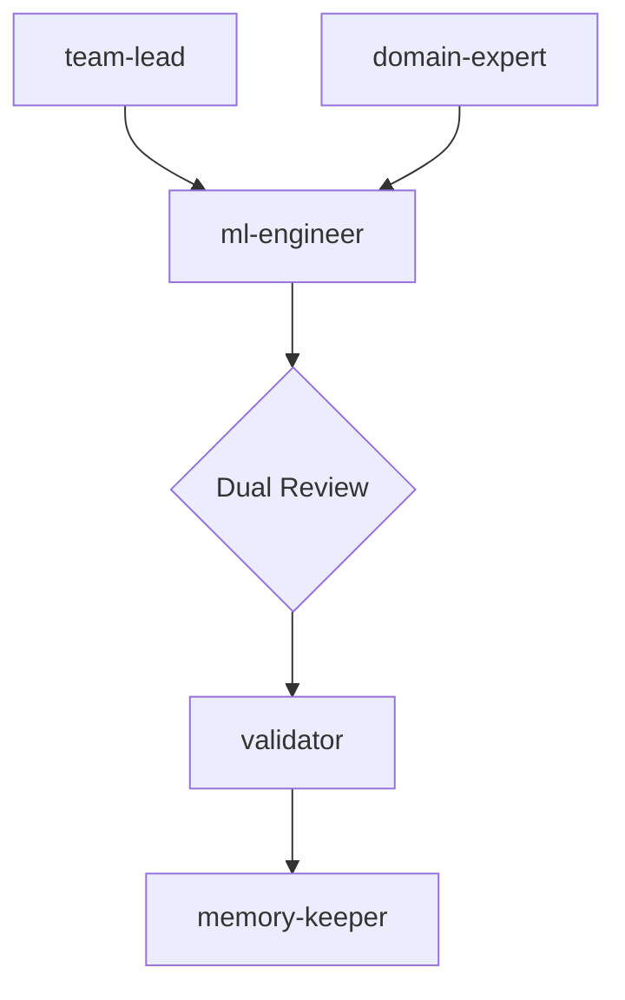

**Matrix topology** — Microsoft-style dual-authority approval.
The `ml-engineer` executes the plan, but their work must be approved by *both* the technical lead (`team-lead`) and the science lead (`domain-expert`). This ensures no leakage and high scientific rigor.

| Role | Responsibility |
| --- | --- |
| **team-lead** | Technical Authority. Ensures the code and logic are sound. |
| **domain-expert** | Scientific Authority. Checks for data leakage, business logic errors, and domain validity. |
| **ml-engineer** | Implementation Partner. Works across both leads to build a valid solution. |
| **evaluator / validator** | Compliance. Ensures the result meets all organizational standards. |
| **memory-keeper** | Knowledge Transfer. Shares the collaborative learnings across the "Ecosystem." |

**Handoff contract:** Every executing role MUST write its result to `.claude/EXPERIMENT_STATE.json` as its final action. The topology reads this file to gate progression — a missing or malformed entry halts the pipeline.
