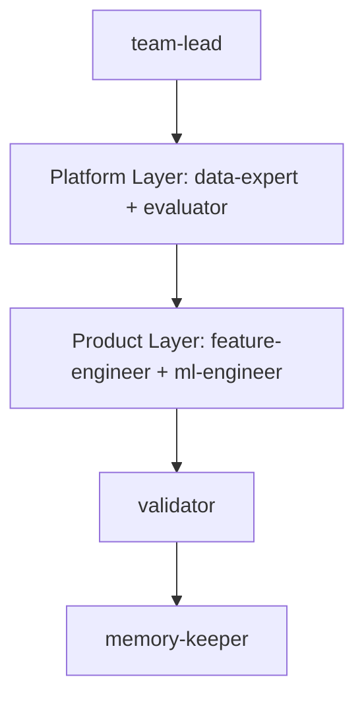

**Platform topology** — Google-style "Product vs Infra" layers.
The `platform-layer` builds the tools (scaffolding, data cleaning, evaluation suites) while the `product-layer` builds the model. This allows for rapid iteration on the model without rewriting boilerplate.

| Role | Responsibility |
| --- | --- |
| **team-lead** | OKR Setting. Defines the objective for the current "Quarter" (Iteration). |
| **platform-layer** | Tooling. `data-expert` builds the `src/` scaffold; `evaluator` builds the scoring harness. |
| **product-layer** | Implementation. `feature-engineer` and `ml-engineer` iterate within the platform's constraints. |
| **validator** | Launch Review. Checks if the experiment meets the "Product Requirements" (Score). |
| **memory-keeper** | Documentation. Updates the "Internal Wiki" (`MEMORY.md`). |

**Handoff contract:** Every executing role MUST write its result to `.claude/EXPERIMENT_STATE.json` as its final action. The topology reads this file to gate progression — a missing or malformed entry halts the pipeline.
