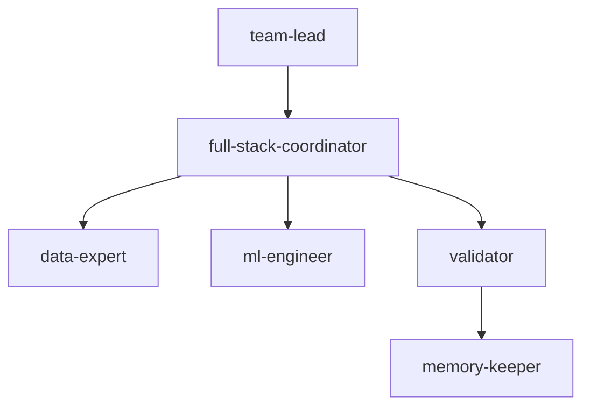

**Two-Pizza topology** — Amazon-style cross-functional ownership.
Instead of a relay race, a `full-stack-coordinator` owns the entire execution of a "Single-Threaded Goal." They delegate to specialists but remain responsible for the "Customer Outcome" (the score).

| Role | Responsibility |
| --- | --- |
| **team-lead** | Principle Enforcement. Ensures the experiment follows the 16 Leadership Principles. |
| **full-stack-coordinator** | Delivery Lead. Writes the core code, orchestrates runs, and fixes bugs in real-time. |
| **data-expert** | On-demand support for schema/EDA bottlenecks. |
| **ml-engineer** | On-demand support for hyperparameter tuning and CV structure. |
| **validator** | "Bar Raiser." Impartially checks if the result is better than the current best. |
| **memory-keeper** | Post-Mortem. Writes the "6-pager" summary into `MEMORY.md`. |

**Handoff contract:** Every executing role MUST write its result to `.claude/EXPERIMENT_STATE.json` as its final action. The topology reads this file to gate progression — a missing or malformed entry halts the pipeline.
